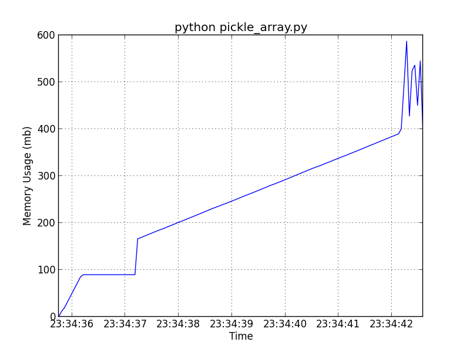
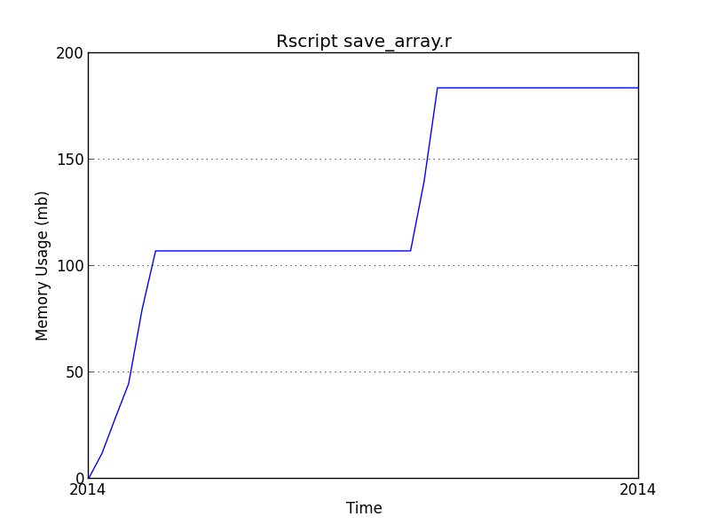

memplot
=======

Plot memory usage of a process


Install
-------

From source:
```bash
$ git clone https://github.com/EricChiang/memplot.git
$ cd memplot
$ python setup.py install
```
pypi:

_Coming soon_

Usage
-----

What's the memory usage of the `pickle` package? Let's consider the following script save under `pickle_array.py`
```python
import numpy as np
import pickle
import time

x = np.random.randn(1000,10000)
time.sleep(1)
p = pickle.dumps(x)
```

To plot memory usage run:
```bash
$ memplot "python pickle_array.py"
```

This command produces the following plot:


How does R do? The following script so serialize a similar array is saved under `save_array.r`

```Rscript
x <- matrix(rnorm(1000,10000),1000,10000)
Sys.sleep(1)
save(x,file="x.Rdata")
```

Time to plot the memory usage:
```bash
$ memplot "Rscript save_array.r"
```


